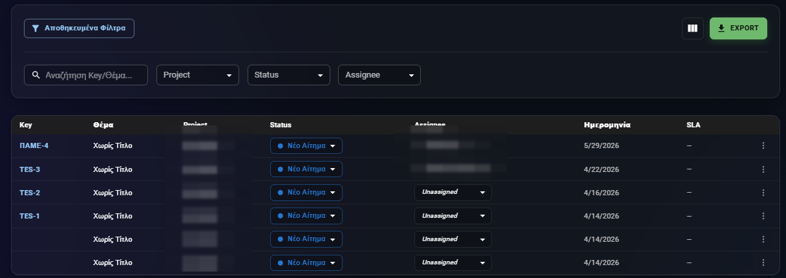
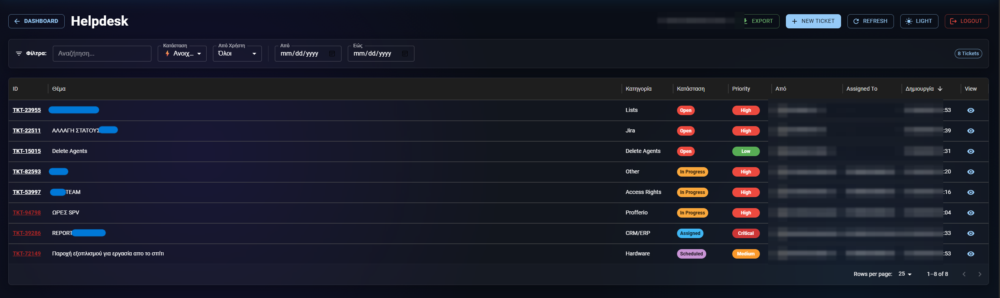
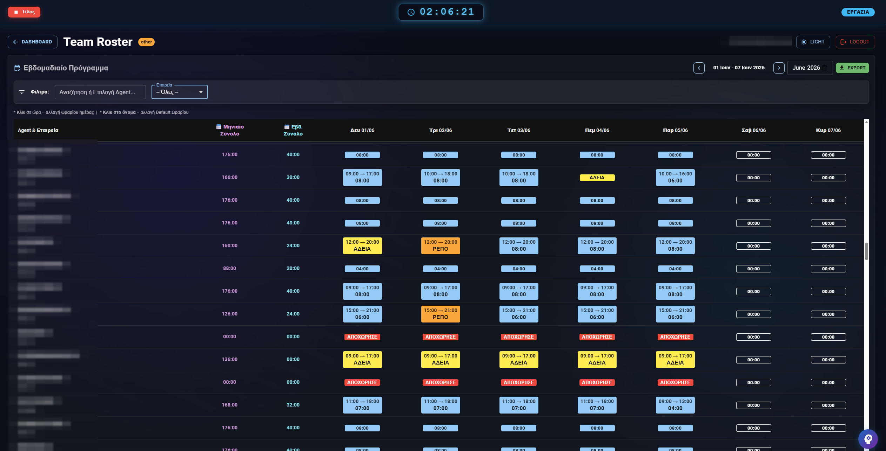
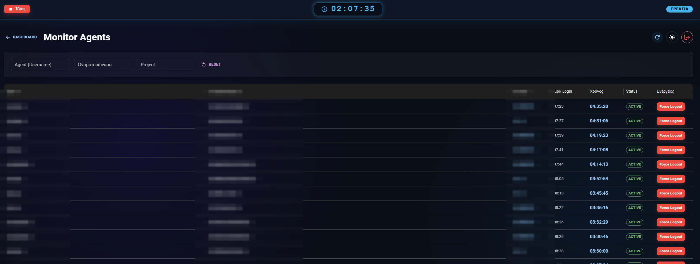
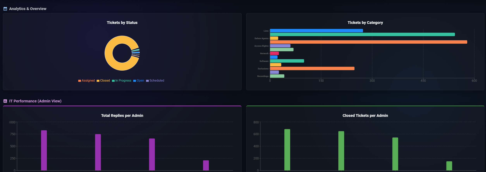
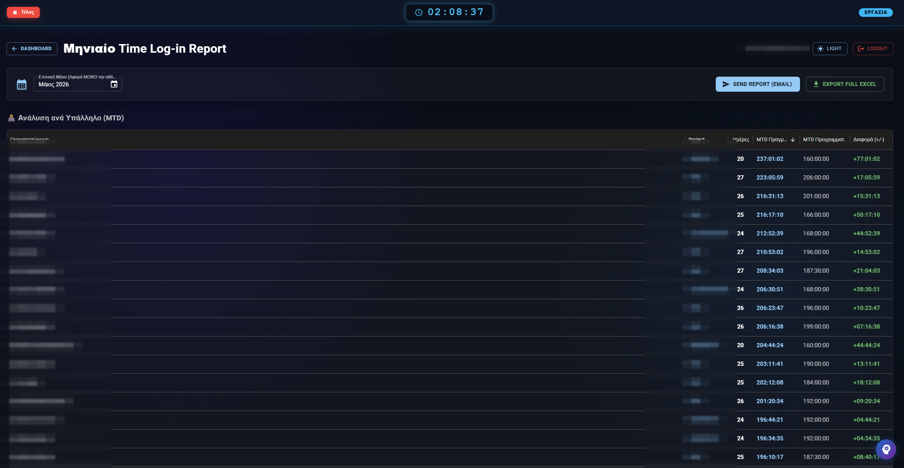
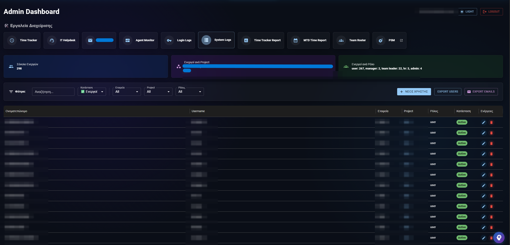
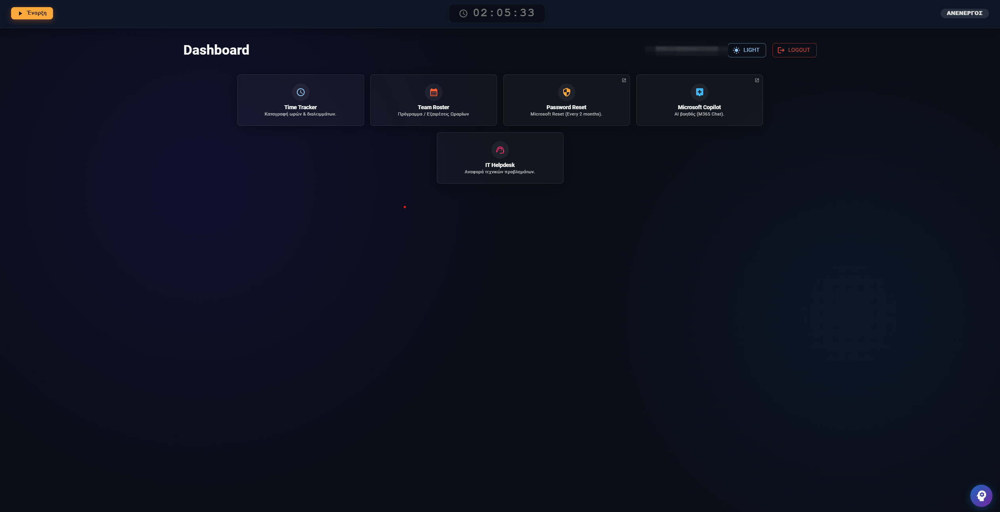

<div align="center">


### Όλη η ομάδα σου, σε ένα μέρος.

**Το ελληνικό σύστημα που αντικαθιστά το ακριβό Jira.** Ticketing, καταγραφή χρόνου & ωραρίου με σύνδεση στην **ΕΡΓΑΝΗ**, workflows, αυτοματισμοί και reports — όλα σε μία σύγχρονη πλατφόρμα.

[](https://www.profferio.com)
[](#-επικοινωνία)
[](#-ασφάλεια--έλεγχος)
[](https://www.profferio.com)
[](LICENSE)

[🇬🇧 English](README.en.md) &nbsp;·&nbsp; **🇬🇷 Ελληνικά**

</div>

<div align="center">



</div>

---

## 🔁 Μία πλατφόρμα, αντί για πολλά εργαλεία

Tickets στο ένα, ωράρια στο άλλο, reports στο Excel. Το Profferio τα ενώνει όλα — και σου κοστίζει λιγότερο.

> Αντικαθιστά: **Jira / JSM** · **Φύλλα Excel** · **Excel ωραρίων** · **Email chaos** · **Χειρόγραφες φόρμες**

| | |
|---|---|
| 💸 **Ακριβές άδειες Jira** | Πληρώνεις ανά χρήστη για δυνατότητες που δεν χρησιμοποιείς — και κάθε customization θέλει σύμβουλο. |
| ⏳ **Χαμένος χρόνος εργασίας** | Ωράρια και βάρδιες σε χειρόγραφα ή Excel, χωρίς σύνδεση με την ΕΡΓΑΝΗ και χωρίς εικόνα παραγωγικότητας. |
| 🙈 **Καμία ορατότητα** | Δεν ξέρεις ποιος δουλεύει σε τι, πού κολλάει η ροή, ή πόσο πάει η ομάδα σου σήμερα. |

---

## ✨ Δυνατότητες

Μία πλατφόρμα για όλη τη ροή εργασίας — από το ticket μέχρι το report.

| | |
|---|---|
| 🎫 **Ticketing System** | Δημιουργία, ανάθεση και παρακολούθηση αιτημάτων με SLA, προτεραιότητες, σχόλια και πλήρες ιστορικό αλλαγών. |
| ⏱️ **Καταγραφή Χρόνου & Διαλειμμάτων** ⭐ | Ρολόι εργασίας με ένα κλικ: ώρες, βάρδιες και διαλείμματα σε πραγματικό χρόνο. Ζωντανή εικόνα παρουσιών και αυτόματος υπολογισμός παραγωγικότητας — τέλος στα Excel. |
| 📝 **Δυναμικές Φόρμες** | Form builder με sections και conditional logic — φτιάξε τις φόρμες που χρειάζεσαι χωρίς γραμμή κώδικα. |
| 🔀 **Workflows χωρίς κώδικα** | Σχεδίασε καταστάσεις, μεταβάσεις, conditions και validators με drag & drop. Κάθε ομάδα, η δική της ροή. |
| ⚡ **Αυτοματισμοί** | Triggers & actions: αυτόματη αρχειοθέτηση, επαναφορά tickets, ειδοποιήσεις, emails και πολλά ακόμη. |
| 📊 **Reports & Dashboards** | Παραγωγικότητα ανά ομάδα, agent ή προϊόν — ημερήσια, εβδομαδιαία και μηνιαία, σε ζωντανά dashboards. |
| 🌐 **Customer Portal** | Οι πελάτες σου υποβάλλουν και παρακολουθούν τα αιτήματά τους από ένα καθαρό, branded portal. |
| 🔔 **Έξυπνες Ειδοποιήσεις** | Email & in-app notifications σε κάθε αλλαγή. Κανένα ticket και καμία προθεσμία δεν χάνεται. |

---

## 🖼️ Δες το Profferio σε δράση

_Πραγματικές οθόνες από την πλατφόρμα — όχι mockups._

| Ticketing System | Advanced PSM Board |
|:---:|:---:|
|  |  |
| **Χρόνος & Ωράριο (Team Roster)** | **Live Monitoring** |
|  |  |
| **Reports & Analytics** | **Μηνιαία Αναφορά Χρόνου** |
|  |  |
| **Admin Dashboard** | **User Dashboard** |
|  |  |

---

## 🎯 Για ποιους

Αν διαχειρίζεσαι αιτήματα, χρόνο ή ροές, το Profferio είναι για σένα.

- **📞 Τηλεπικοινωνίες & Πωλήσεις** — διαχείριση αιτήσεων, καταχωρήσεων και ροών πώλησης με πολλαπλά στάδια
- **🎧 Εξυπηρέτηση Πελατών** — help desk με SLA, customer portal και πλήρες ιστορικό επικοινωνίας
- **💻 IT & Support ομάδες** — service desk, incident & request management σαν το Jira, στο δικό σου κόστος
- **📈 BPO & Call Centers** — καταγραφή χρόνου, βάρδιες, παραγωγικότητα agents και reports σε πραγματικό χρόνο
- **👥 HR & Διοίκηση** — ωράρια, παρουσίες και σύνδεση με ΕΡΓΑΝΗ, χωρίς Excel και χειρόγραφα
- **⚙️ Operations** — αυτοματοποίησε επαναλαμβανόμενες ροές και κράτα τα πάντα ορατά σε μία οθόνη

---

## 🔐 Ασφάλεια & Έλεγχος

Τα δεδομένα σου, εκεί που τα θες — στο cloud μας ή στους δικούς σου servers.

- 🛡️ **Penetration tested** — η πλατφόρμα έχει περάσει έλεγχο διείσδυσης για μέγιστη ασφάλεια
- ☁️ **Cloud ή On-Premise** — φιλοξενία στο ασφαλές cloud μας ή εγκατάσταση στη δική σου υποδομή
- 🇬🇷 **Σύνδεση με ΕΡΓΑΝΗ** — άμεση διασύνδεση ωραρίων και παρουσιών με το πληροφοριακό σύστημα ΕΡΓΑΝΗ
- 🔏 **GDPR-friendly** — σχεδιασμένο με σεβασμό στα προσωπικά δεδομένα και τη νομοθεσία

---

## 🏗️ Πώς λειτουργεί

**Σε λειτουργία μέσα σε μέρες, όχι μήνες.** Αναλαμβάνουμε την υλοποίηση και την προσαρμογή στις ανάγκες σου.

1. **Demo & ανάλυση αναγκών** — μας δείχνεις πώς δουλεύει η ομάδα σου σήμερα· σχεδιάζουμε μαζί τη ροή στο Profferio
2. **Υλοποίηση & προσαρμογή** — στήνουμε projects, φόρμες, workflows και αυτοματισμούς στα μέτρα σου (cloud ή on-premise)
3. **Εκπαίδευση & go-live** — εκπαιδεύουμε την ομάδα και είμαστε δίπλα σου από την πρώτη μέρα

Κάθε εταιρία αποκτά τη **δική της απομονωμένη εγκατάσταση** σε ξεχωριστό subdomain:

```
company1.profferio.com  ─┐
company2.profferio.com  ─┼──►  Απομονωμένο περιβάλλον ανά εταιρία
company3.profferio.com  ─┘     (ξεχωριστός κώδικας + δεδομένα)
```

**Τεχνολογία:** React · Node.js · MongoDB · Socket.io · AI

---

## 💼 Πακέτα

Ευέλικτη τιμολόγηση, **προσαρμοσμένη στην ομάδα και τις ανάγκες σου**. Διάλεξε το πακέτο που σου ταιριάζει και ζήτησε προσφορά.

| | **Starter** | **Business** ⭐ _Δημοφιλέστερο_ | **Enterprise** |
|---|---|---|---|
| **Ιδανικό για** | Μικρές ομάδες που ξεκινούν | Πλήρης εικόνα ομάδας σε πραγματικό χρόνο | On-premise & πλήρης προσαρμογή |
| Ticketing & δυναμικές φόρμες | ✅ | ✅ | ✅ |
| Customer portal & email ειδοποιήσεις | ✅ | ✅ | ✅ |
| ⏱️ Καταγραφή χρόνου, ωραρίου & διαλειμμάτων | — | ✅ | ✅ |
| Live παρακολούθηση παρουσιών | — | ✅ | ✅ |
| Workflows, αυτοματισμοί & reports | — | ✅ | ✅ |
| Σύνδεση με ΕΡΓΑΝΗ | — | — | ✅ |
| Εγκατάσταση on-premise & απεριόριστοι χρήστες | — | — | ✅ |
| Custom integrations, SSO & dedicated support | — | — | ✅ |

> 💡 Διαθέσιμο σε **Cloud** ή **On-Premise**. Η τιμολόγηση διαμορφώνεται ανά περίπτωση, μετά από μια σύντομη ανάλυση αναγκών. [**Ζήτησε προσφορά**](#-επικοινωνία).

---

## ❓ Συχνές ερωτήσεις

**Μπορεί να αντικαταστήσει το Jira;** Ναι. Καλύπτει projects, workflows, conditions/validators, αυτοματισμούς και reports αντίστοιχα με το Jira Service Management — σε σημαντικά χαμηλότερο κόστος.

**Μπορώ να το έχω στους δικούς μου servers;** Ναι, είτε στο ασφαλές cloud μας είτε on-premise στη δική σου υποδομή.

**Συνδέεται πραγματικά με την ΕΡΓΑΝΗ;** Ναι — η καταγραφή ωραρίου και παρουσιών μπορεί να διασυνδεθεί με το σύστημα ΕΡΓΑΝΗ.

**Πόσο γρήγορα μπαίνει σε λειτουργία;** Συνήθως μέσα σε λίγες μέρες — αναλαμβάνουμε υλοποίηση, προσαρμογή και εκπαίδευση.

→ Περισσότερες ερωτήσεις στο [docs/faq.md](docs/faq.md) · Δυνατότητες αναλυτικά στο [docs/features.md](docs/features.md) · [Changelog](CHANGELOG.md)

---

## 🧩 Integrations & API

Το Profferio εκτίθεται μέσω ενός καθαρού REST API και event-driven αυτοματισμών, ώστε να συνδέεται με τα συστήματά σου. _Τα παρακάτω είναι ενδεικτικά παραδείγματα._

**Δημιουργία ticket μέσω API**

```http
POST /api/psm/tickets
Authorization: Bearer <token>
Content-Type: application/json

{
  "project": "SUPPORT",
  "summary": "Νέο αίτημα πελάτη",
  "priority": "high",
  "fields": { "category": "billing", "channel": "email" }
}
```

**Παράδειγμα κανόνα αυτοματισμού** — αυτόματη ανάθεση & σχόλιο όταν δημιουργείται high-priority ticket:

```json
{
  "trigger": "TICKET_CREATED",
  "conditions": [{ "field": "priority", "op": "equals", "value": "high" }],
  "actions": [
    { "type": "assign", "to": "team-lead" },
    { "type": "comment", "text": "Προτεραιότητα: ανάληψη εντός SLA." }
  ]
}
```

---

## 📨 Επικοινωνία

**Έτοιμος να ενώσεις την ομάδα σου;** Κλείσε ένα δωρεάν demo και δες το Profferio πάνω στις δικές σου ροές.

- 🌐 **Ιστοσελίδα:** [www.profferio.com](https://www.profferio.com)
- ✉️ **Email:** [akis.barliakos@profferio.com](mailto:akis.barliakos@profferio.com)
- 📞 **Τηλέφωνο:** [+30 695 783 6859](tel:+306957836859)
- 👤 **Επικοινωνία:** [Akis Barliakos](https://www.profferio.com/info/)
- 🐞 **Βρήκες πρόβλημα;** [Άνοιξε ένα ticket](../../issues/new/choose)

<div align="center">

---

<sub>© Profferio — Με επιφύλαξη παντός δικαιώματος. Το Profferio είναι ιδιόκτητο λογισμικό.</sub>

</div>
